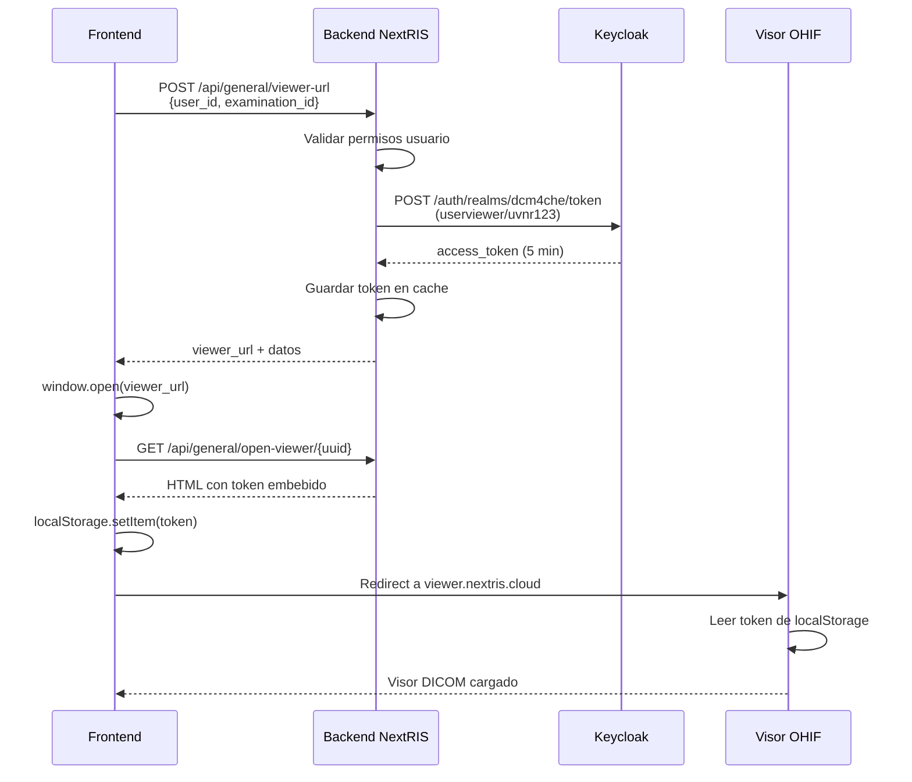

# API de Visor DICOM - Documentación para Frontend

## Descripción General

API REST para obtener acceso autenticado al visor DICOM (OHIF). El backend valida los permisos del usuario, genera un token de Keycloak con el usuario genérico del visor y devuelve una URL única de acceso temporal.

---

## Endpoint Principal

### `POST /api/general/viewer-url`

Solicita una URL de acceso al visor DICOM para un examen específico.

**Autenticación**: Requerida (Bearer Token de NextRIS)

**URL**: `https://nextris.cloud/api/general/viewer-url`

---

## Request

### Headers
```http
Authorization: Bearer {token_nextris}
Content-Type: application/json
```

### Body (JSON)
```json
{
  "user_id": "9388650a-fa37-4cb1-b346-e68ef2407d1b",
  "examination_id": "5cbf5499-febd-47e9-a465-5117eb7c432d"
}
```

**Parámetros:**
- `user_id` (string, required): GUID del usuario en NextRIS
- `examination_id` (string, required): GUID del examen en la tabla `tbexamination`

---

## Response

### Éxito (200 OK)

```json
{
  "success": true,
  "data": {
    "viewer_url": "https://nextris.cloud/api/general/open-viewer/ac7591a2-e6dd-476d-be0b-a596316457c0",
    "study_uid": "1.2.826.0.1.3680043.8.498.13201767099594831302408562419423378227",
    "html_page": "<!DOCTYPE html>...",
    "direct_url": "https://viewer.nextris.cloud/viewer?StudyInstanceUIDs=1.2.826...",
    "access_token": "eyJhbGciOiJSUzI1NiIsInR5cC...",
    "expires_in": 300
  }
}
```

**Campos de respuesta:**

| Campo | Tipo | Descripción |
|-------|------|-------------|
| `viewer_url` | string | **URL PRINCIPAL** - Abrir esta URL en nueva ventana. Redirige automáticamente al visor con token. |
| `study_uid` | string | UID del estudio DICOM |
| `html_page` | string | HTML completo con auto-login (alternativa a viewer_url) |
| `direct_url` | string | URL directa al visor (requiere login manual) |
| `access_token` | string | Token de Keycloak (válido 5 minutos) |
| `expires_in` | integer | Tiempo de expiración en segundos (300 = 5 minutos) |

### Error: Sin permisos (403 Forbidden)

```json
{
  "success": false,
  "message": "No tiene permisos para ver las imágenes de esta ubicación"
}
```

### Error: Examen no encontrado (404 Not Found)

```json
{
  "success": false,
  "message": "Examen no encontrado"
}
```

### Error: Datos inválidos (400 Bad Request)

```json
{
  "success": false,
  "message": "user_id y examination_id son requeridos"
}
```

---

## Pasos de Implementación para el Frontend

### 📋 Checklist de Implementación

#### 1. **Crear el Servicio de API** (15 minutos)

Crea el archivo `src/services/dicomViewer.ts`:

```typescript
// src/services/dicomViewer.ts
import { getAuthToken } from './auth'; // Ajusta según tu implementación

interface ViewerResponse {
  success: boolean;
  data?: {
    viewer_url: string;
    study_uid: string;
    expires_in: number;
    access_token: string;
    html_page: string;
    direct_url: string;
  };
  message?: string;
}

export const openDicomViewer = async (
  userId: string,
  examinationId: string
): Promise<void> => {
  try {
    const response = await fetch('/api/general/viewer-url', {
      method: 'POST',
      headers: {
        'Authorization': `Bearer ${getAuthToken()}`,
        'Content-Type': 'application/json'
      },
      body: JSON.stringify({
        user_id: userId,
        examination_id: examinationId
      })
    });

    if (!response.ok) {
      throw new Error(`HTTP ${response.status}`);
    }

    const data: ViewerResponse = await response.json();

    if (data.success && data.data) {
      // Abrir en nueva ventana
      const viewerWindow = window.open(
        data.data.viewer_url,
        '_blank',
        'width=1400,height=900,resizable=yes,scrollbars=yes'
      );

      if (!viewerWindow) {
        alert('Por favor, permite popups para abrir el visor DICOM');
      }
    } else {
      throw new Error(data.message || 'Error desconocido');
    }
  } catch (error) {
    console.error('Error al abrir visor DICOM:', error);
    throw error;
  }
};
```

#### 2. **Crear el Componente Botón** (10 minutos)

Crea el componente `src/components/DicomViewerButton.tsx`:

```tsx
// src/components/DicomViewerButton.tsx
import React, { useState } from 'react';
import { Button } from '@/components/ui/button';
import { Eye, Loader2 } from 'lucide-react';
import { openDicomViewer } from '@/services/dicomViewer';
import { useToast } from '@/hooks/use-toast';

interface DicomViewerButtonProps {
  userId: string;
  examinationId: string;
  disabled?: boolean;
  variant?: 'default' | 'outline' | 'ghost';
  size?: 'default' | 'sm' | 'lg';
}

export const DicomViewerButton: React.FC<DicomViewerButtonProps> = ({
  userId,
  examinationId,
  disabled = false,
  variant = 'default',
  size = 'default'
}) => {
  const [loading, setLoading] = useState(false);
  const { toast } = useToast();

  const handleClick = async () => {
    setLoading(true);
    try {
      await openDicomViewer(userId, examinationId);
      toast({
        title: "Visor abierto",
        description: "El visor DICOM se ha abierto en una nueva ventana",
      });
    } catch (error) {
      toast({
        title: "Error",
        description: error instanceof Error ? error.message : "No se pudo abrir el visor DICOM",
        variant: "destructive"
      });
    } finally {
      setLoading(false);
    }
  };

  return (
    <Button
      onClick={handleClick}
      disabled={disabled || loading}
      variant={variant}
      size={size}
    >
      {loading ? (
        <>
          <Loader2 className="mr-2 h-4 w-4 animate-spin" />
          Abriendo...
        </>
      ) : (
        <>
          <Eye className="mr-2 h-4 w-4" />
          Ver Imágenes
        </>
      )}
    </Button>
  );
};
```

#### 3. **Integrar en la Tabla de Exámenes** (5 minutos)

En tu componente de tabla de exámenes (ejemplo: `src/pages/Examinations.tsx`):

```tsx
import { DicomViewerButton } from '@/components/DicomViewerButton';

// Dentro de tu tabla, en la columna de acciones:
<TableCell>
  <DicomViewerButton
    userId={currentUser.id}
    examinationId={examination.guid}
    size="sm"
    variant="outline"
  />
</TableCell>
```

#### 4. **Alternativa: Hook Personalizado** (Opcional, 10 minutos)

Si prefieres más control, crea un hook:

```tsx
// src/hooks/useDicomViewer.ts
import { useState } from 'react';
import { openDicomViewer } from '@/services/dicomViewer';

export const useDicomViewer = () => {
  const [loading, setLoading] = useState(false);
  const [error, setError] = useState<string | null>(null);

  const open = async (userId: string, examinationId: string) => {
    setLoading(true);
    setError(null);
    
    try {
      await openDicomViewer(userId, examinationId);
      return true;
    } catch (err) {
      const errorMessage = err instanceof Error ? err.message : 'Error desconocido';
      setError(errorMessage);
      return false;
    } finally {
      setLoading(false);
    }
  };

  return { open, loading, error };
};
```

Uso del hook:

```tsx
const { open, loading, error } = useDicomViewer();

<button 
  onClick={() => open(userId, examinationId)}
  disabled={loading}
>
  {loading ? 'Abriendo...' : 'Ver Imágenes'}
</button>

{error && <p className="text-red-500">{error}</p>}
```

#### 5. **Configurar Variables de Entorno** (2 minutos)

En tu `.env` o `.env.local`:

```env
VITE_API_BASE_URL=https://nextris.cloud
```

Y en tu código:

```typescript
const API_BASE_URL = import.meta.env.VITE_API_BASE_URL || '';
```

#### 6. **Testing Manual** (5 minutos)

1. Abre la aplicación en desarrollo
2. Navega a la lista de exámenes
3. Haz clic en "Ver Imágenes"
4. Verifica que:
   - ✅ Se abre una nueva ventana
   - ✅ Muestra pantalla de "Abriendo visor DICOM..."
   - ✅ Redirige automáticamente al visor OHIF
   - ✅ No pide credenciales de Keycloak
   - ✅ Carga las imágenes del estudio

#### 7. **Manejo de Errores Comunes**

Agrega manejo para estos casos:

```tsx
const handleError = (error: any) => {
  if (error.message?.includes('403')) {
    toast({
      title: "Sin permisos",
      description: "No tienes permisos para ver las imágenes de esta ubicación",
      variant: "destructive"
    });
  } else if (error.message?.includes('404')) {
    toast({
      title: "No encontrado",
      description: "El examen no tiene imágenes asociadas",
      variant: "destructive"
    });
  } else if (error.message?.includes('popup')) {
    toast({
      title: "Popup bloqueado",
      description: "Por favor, permite popups en tu navegador",
      variant: "destructive"
    });
  } else {
    toast({
      title: "Error",
      description: "No se pudo abrir el visor. Intenta de nuevo.",
      variant: "destructive"
    });
  }
};
```

---

## Implementación en Frontend

### Opción 1: Usar `viewer_url` (RECOMENDADO)

La forma más simple. El backend maneja todo automáticamente.

```typescript
const openDicomViewer = async (userId: string, examinationId: string) => {
  try {
    const response = await fetch('https://nextris.cloud/api/general/viewer-url', {
      method: 'POST',
      headers: {
        'Authorization': `Bearer ${getAuthToken()}`,
        'Content-Type': 'application/json'
      },
      body: JSON.stringify({
        user_id: userId,
        examination_id: examinationId
      })
    });

    const data = await response.json();

    if (data.success) {
      // Abrir el visor en nueva ventana
      window.open(data.data.viewer_url, '_blank', 'width=1400,height=900');
    } else {
      alert(`Error: ${data.message}`);
    }
  } catch (error) {
    console.error('Error al abrir visor:', error);
    alert('No se pudo abrir el visor DICOM');
  }
};
```

### Opción 2: Usar `html_page` en Popup

Si necesitas más control, puedes inyectar el HTML directamente.

```typescript
const openDicomViewerWithHTML = async (userId: string, examinationId: string) => {
  const response = await fetch('https://nextris.cloud/api/general/viewer-url', {
    method: 'POST',
    headers: {
      'Authorization': `Bearer ${getAuthToken()}`,
      'Content-Type': 'application/json'
    },
    body: JSON.stringify({ user_id: userId, examination_id: examinationId })
  });

  const data = await response.json();

  if (data.success) {
    // Crear Blob del HTML y abrirlo
    const blob = new Blob([data.data.html_page], { type: 'text/html' });
    const url = URL.createObjectURL(blob);
    const popup = window.open(url, '_blank', 'width=1400,height=900');
    
    // Limpiar URL después de 10 segundos
    setTimeout(() => URL.revokeObjectURL(url), 10000);
  }
};
```

### Opción 3: Componente React

```tsx
import React, { useState } from 'react';
import { Button } from '@/components/ui/button';

interface ViewerButtonProps {
  userId: string;
  examinationId: string;
  patientName?: string;
}

export const DicomViewerButton: React.FC<ViewerButtonProps> = ({ 
  userId, 
  examinationId,
  patientName 
}) => {
  const [loading, setLoading] = useState(false);

  const handleOpenViewer = async () => {
    setLoading(true);
    try {
      const response = await fetch('/api/general/viewer-url', {
        method: 'POST',
        headers: {
          'Authorization': `Bearer ${localStorage.getItem('auth_token')}`,
          'Content-Type': 'application/json'
        },
        body: JSON.stringify({
          user_id: userId,
          examination_id: examinationId
        })
      });

      const data = await response.json();

      if (data.success) {
        window.open(data.data.viewer_url, '_blank', 'width=1400,height=900');
      } else {
        alert(`Error: ${data.message}`);
      }
    } catch (error) {
      console.error('Error:', error);
      alert('No se pudo abrir el visor');
    } finally {
      setLoading(false);
    }
  };

  return (
    <Button 
      onClick={handleOpenViewer} 
      disabled={loading}
    >
      {loading ? 'Abriendo...' : '📺 Ver Imágenes DICOM'}
    </Button>
  );
};
```

---

## Flujo de Autenticación



---

## Validaciones del Backend

Antes de devolver la URL, el backend verifica:

1. ✅ **Usuario autenticado**: Token JWT de NextRIS válido
2. ✅ **Examen existe**: `examination_id` existe en `tbexamination`
3. ✅ **Tiene location**: El examen tiene `location_id` asignado
4. ✅ **Tiene Study UID**: El examen tiene `studyinstanceuid`
5. ✅ **Permisos de ubicación**: Usuario tiene acceso a la location vía `rel_user_location`

---

## Características de Seguridad

### 🛡️ Sistema de Seguridad Multicapa

El sistema implementa **5 capas de protección** para garantizar que solo usuarios autorizados accedan a estudios específicos:

#### 1. **Token de un solo uso**
- La `viewer_url` solo funciona una vez
- Después de usarse, el `access_id` se elimina del cache
- No se puede reutilizar el mismo enlace

#### 2. **Session ID único por acceso**
- Cada vez que se solicita acceso, se genera un `session_id` único
- El session_id se guarda en localStorage del navegador
- Vincula al usuario con el estudio específico autorizado

#### 3. **Lista blanca de estudios permitidos**
- Cada sesión tiene un array `allowed_studies` con los Study UIDs autorizados
- Solo puede acceder a los estudios de esa lista
- Si intenta acceder a otro estudio → **403 Forbidden**

#### 4. **Expiración temporal**
- Token de Keycloak: **5 minutos**
- Session ID: **5 minutos**
- Después de expirar, debe solicitar nuevo acceso

#### 5. **Validación de permisos previa**
- Backend valida en `rel_user_location` antes de generar token
- Solo usuarios con permisos sobre la location del examen obtienen acceso
- Validación a nivel de base de datos

### 📊 Datos almacenados en la sesión

```json
{
  "session_id": "uuid-generado",
  "user_id": "guid-del-usuario",
  "location_id": "guid-de-la-location",
  "allowed_studies": ["1.2.826.0.1.3680043..."],
  "access_token": "eyJhbGc...",
  "expires_at": "2025-12-07T10:30:00",
  "created_at": "2025-12-07T10:25:00"
}
```

### 🔍 Flujo de Seguridad Completo

```
1. Usuario hace clic en "Ver Imágenes"
   ↓
2. Frontend envía: user_id + examination_id
   ↓
3. Backend valida:
   ✓ Usuario autenticado (JWT NextRIS)
   ✓ Examen existe en BD
   ✓ Usuario tiene permiso en rel_user_location
   ↓
4. Backend genera:
   • Token de Keycloak (userviewer/uvnr123)
   • Session ID único
   • Lista: allowed_studies = [study_uid_autorizado]
   ↓
5. Backend guarda en cache:
   • viewer_tokens_cache[access_id]
   • viewer_sessions_cache[session_id]
   ↓
6. Frontend recibe: viewer_url + session_id
   ↓
7. Usuario abre viewer_url en nueva ventana
   ↓
8. Página intermedia guarda en localStorage:
   • access_token (Keycloak)
   • session_id (NextRIS)
   ↓
9. Redirige a: viewer.nextris.cloud/viewer?StudyInstanceUIDs=X&session_id=Y
   ↓
10. OHIF intenta cargar estudio
    ↓
11. (Opcional) Frontend puede validar con:
    POST /api/general/validate-session
    ↓
12. Si study_uid ∈ allowed_studies → ✅ Permitido
    Si study_uid ∉ allowed_studies → ❌ 403 Forbidden
```

---

## Testing

### Ejemplo con cURL

```bash
# 1. Login para obtener token de NextRIS
curl -X POST https://nextris.cloud/api/auth/login \
  -H "Content-Type: application/json" \
  -d '{
    "username": "sysadmin",
    "password": "tu_password"
  }'

# 2. Solicitar URL del visor
curl -X POST https://nextris.cloud/api/general/viewer-url \
  -H "Authorization: Bearer {token_from_step_1}" \
  -H "Content-Type: application/json" \
  -d '{
    "user_id": "9388650a-fa37-4cb1-b346-e68ef2407d1b",
    "examination_id": "5cbf5499-febd-47e9-a465-5117eb7c432d"
  }'

# 3. Abrir la viewer_url en el navegador
```

### Script de prueba Python

Ver archivo: `/var/www/nextris-dev-react/tests/test_general_api.py`

```bash
cd /var/www/nextris-dev-react
python3 tests/test_general_api.py
```

---

## Notas Importantes

- ⚠️ **viewer_url es temporal**: Solo se puede usar una vez y expira en 5 minutos
- ⚠️ **No guardar viewer_url**: Siempre generar una nueva URL por petición
- ⚠️ **Popup blockers**: Asegúrate de que el navegador permita popups desde nextris.cloud
- ⚠️ **CORS**: Ya configurado en Nginx, no requiere cambios frontend
- ✅ **Funciona en**: Chrome, Firefox, Edge, Safari

---

## Soporte

Para dudas o problemas:
- Backend: `/var/www/nextris-dev-react/apps/api/general.py`
- Tests: `/var/www/nextris-dev-react/tests/test_general_api.py`
- Logs: `sudo journalctl -u nextris-dev-react.service -f`

---

## Ejemplo Completo (Copy-Paste Ready)

```typescript
// services/dicomViewer.ts
export const openDicomViewer = async (
  userId: string, 
  examinationId: string
): Promise<void> => {
  try {
    const response = await fetch('/api/general/viewer-url', {
      method: 'POST',
      headers: {
        'Authorization': `Bearer ${localStorage.getItem('nextris_token')}`,
        'Content-Type': 'application/json'
      },
      body: JSON.stringify({
        user_id: userId,
        examination_id: examinationId
      })
    });

    if (!response.ok) {
      throw new Error(`HTTP ${response.status}`);
    }

    const data = await response.json();

    if (data.success) {
      // Abrir en nueva ventana
      const viewerWindow = window.open(
        data.data.viewer_url,
        '_blank',
        'width=1400,height=900,resizable=yes,scrollbars=yes'
      );

      if (!viewerWindow) {
        alert('Por favor, permite popups para abrir el visor DICOM');
      }
    } else {
      throw new Error(data.message || 'Error desconocido');
    }
  } catch (error) {
    console.error('Error al abrir visor DICOM:', error);
    throw error;
  }
};
```

**Uso en componente:**

```tsx
<button onClick={() => openDicomViewer(user.id, exam.id)}>
  Ver Imágenes
</button>
```

---

## Resumen de Archivos a Crear/Modificar

### Nuevos Archivos

1. ✅ `src/services/dicomViewer.ts` - Servicio para llamar al API
2. ✅ `src/components/DicomViewerButton.tsx` - Componente botón reutilizable
3. ✅ `src/hooks/useDicomViewer.ts` - Hook personalizado (opcional)

### Archivos a Modificar

1. 📝 `src/pages/Examinations.tsx` (o similar) - Agregar botón en tabla
2. 📝 `.env.local` - Configurar URL del API

### Tiempo Estimado de Implementación

- **Básico** (solo botón funcional): ~30 minutos
- **Completo** (con manejo de errores y estados): ~1 hora
- **Con testing**: ~1.5 horas

---

## Troubleshooting

### ❌ "Popup bloqueado"
**Solución**: Asegúrate de que `window.open()` se llame directamente en el evento `onClick`, no en un callback asíncrono posterior.

### ❌ "403 Forbidden"
**Solución**: Verifica que el usuario tenga permisos en la tabla `rel_user_location` para la ubicación del examen.

### ❌ "CORS Error"
**Solución**: Ya está configurado en el backend. Si persiste, verifica que estés usando la URL correcta del API.

### ❌ "ERR_TIMED_OUT"
**Solución**: Verifica que el backend esté corriendo (`sudo systemctl status nextris-dev-react.service`).

### ❌ Pide credenciales en el visor
**Solución**: El token no se guardó en localStorage. Verifica que la página intermedia se cargue antes de redirigir al visor.

---

---

## Nuevo Endpoint: Validación de Sesión

### `POST /api/general/validate-session`

Valida si una sesión del visor tiene permisos para acceder a un Study UID específico.

**Uso:** Opcional, para verificar permisos antes de mostrar estudios adicionales.

#### Request

```json
{
  "session_id": "uuid-de-la-sesion",
  "study_uid": "1.2.826.0.1.3680043.8.498..." // Opcional
}
```

#### Response - Éxito

```json
{
  "success": true,
  "data": {
    "session_id": "abc-123-...",
    "user_id": "9388650a-fa37-4cb1-b346-e68ef2407d1b",
    "location_id": "3bd59315-52de-4a40-b6c5-f4a8a4df2d61",
    "allowed_studies": [
      "1.2.826.0.1.3680043.8.498.13201767099594831302408562419423378227"
    ],
    "expires_at": "2025-12-07T10:30:00"
  }
}
```

#### Response - Sin permisos

```json
{
  "success": false,
  "message": "No tiene permisos para este estudio"
}
```

#### Ejemplo de uso

```typescript
const validateAccess = async (sessionId: string, studyUid: string) => {
  const response = await fetch('/api/general/validate-session', {
    method: 'POST',
    headers: { 'Content-Type': 'application/json' },
    body: JSON.stringify({
      session_id: sessionId,
      study_uid: studyUid
    })
  });
  
  const data = await response.json();
  return data.success;
};

// Uso
const sessionId = localStorage.getItem('nextris_session_id');
const canView = await validateAccess(sessionId, '1.2.826...');

if (canView) {
  // Mostrar estudio
} else {
  alert('No tiene permisos para ver este estudio');
}
```

---

## Preguntas Frecuentes (FAQ)

### ❓ ¿Puede un usuario ver cualquier imagen con el token de Keycloak?

**No.** Aunque el token de Keycloak es genérico (usuario `userviewer`), el sistema implementa control de acceso mediante:
1. Session ID único por acceso
2. Lista blanca de Study UIDs permitidos en la sesión
3. Validación previa de permisos en `rel_user_location`

### ❓ ¿Qué pasa si alguien intercepta el token de Keycloak?

El token solo es válido por **5 minutos**. Además:
- No puede usarse para modificar datos (solo lectura)
- Está vinculado a un session_id específico
- Solo permite acceder a los estudios autorizados en esa sesión

### ❓ ¿El usuario puede cambiar el Study UID en la URL manualmente?

Técnicamente sí, pero:
- El session_id restringe qué estudios puede ver
- Si intenta ver un estudio no autorizado, puede implementarse validación
- El token expira rápidamente (5 min)

### ❓ ¿Cómo se renueva el acceso si el token expira?

El usuario debe:
1. Cerrar el visor
2. Volver a NextRIS
3. Hacer clic nuevamente en "Ver Imágenes"
4. Se generará un nuevo token y session_id

### ❓ ¿Se pueden ver múltiples estudios en una sesión?

Actualmente **no**. Cada sesión está limitada a un Study UID específico. Para ver otro estudio, debe solicitar un nuevo acceso desde NextRIS.

**Mejora futura**: Podría modificarse para agregar múltiples Study UIDs a `allowed_studies` en una misma sesión.

---

**Última actualización**: Diciembre 7, 2025  
**Versión del API**: 1.1 (Con sistema de sesiones de seguridad)  
**Desarrollador Backend**: Sistema NextRIS  
**Para dudas**: Ver sección "Soporte" arriba
