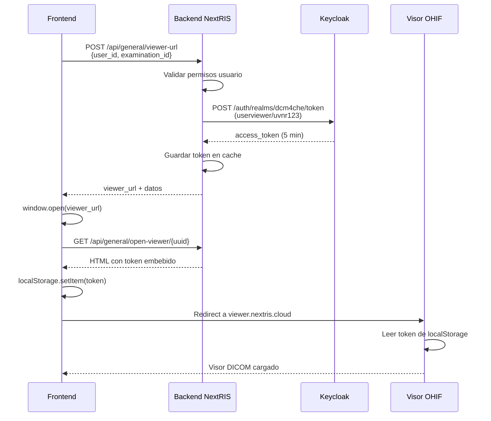

# API de Visor DICOM - Documentación para Frontend

## Descripción General

API REST para obtener acceso autenticado al visor DICOM (OHIF). El backend valida los permisos del usuario, genera un token de Keycloak con el usuario genérico del visor y devuelve una URL única de acceso temporal.

---

## Endpoint Principal

### `POST /api/general/viewer-url`

Solicita una URL de acceso al visor DICOM para un examen específico.

**Autenticación**: Requerida (Bearer Token de NextRIS)

**URL**: `https://nextris.cloud/api/general/viewer-url`

---

## Request

### Headers
```http
Authorization: Bearer {token_nextris}
Content-Type: application/json
```

### Body (JSON)
```json
{
  "user_id": "9388650a-fa37-4cb1-b346-e68ef2407d1b",
  "examination_id": "5cbf5499-febd-47e9-a465-5117eb7c432d"
}
```

**Parámetros:**
- `user_id` (string, required): GUID del usuario en NextRIS
- `examination_id` (string, required): GUID del examen en la tabla `tbexamination`

---

## Response

### Éxito (200 OK)

```json
{
  "success": true,
  "data": {
    "viewer_url": "https://nextris.cloud/api/general/open-viewer/ac7591a2-e6dd-476d-be0b-a596316457c0",
    "study_uid": "1.2.826.0.1.3680043.8.498.13201767099594831302408562419423378227",
    "html_page": "<!DOCTYPE html>...",
    "direct_url": "https://viewer.nextris.cloud/viewer?StudyInstanceUIDs=1.2.826...",
    "access_token": "eyJhbGciOiJSUzI1NiIsInR5cC...",
    "expires_in": 300
  }
}
```

**Campos de respuesta:**

| Campo | Tipo | Descripción |
|-------|------|-------------|
| `viewer_url` | string | **URL PRINCIPAL** - Abrir esta URL en nueva ventana. Redirige automáticamente al visor con token. |
| `study_uid` | string | UID del estudio DICOM |
| `html_page` | string | HTML completo con auto-login (alternativa a viewer_url) |
| `direct_url` | string | URL directa al visor (requiere login manual) |
| `access_token` | string | Token de Keycloak (válido 5 minutos) |
| `expires_in` | integer | Tiempo de expiración en segundos (300 = 5 minutos) |

### Error: Sin permisos (403 Forbidden)

```json
{
  "success": false,
  "message": "No tiene permisos para ver las imágenes de esta ubicación"
}
```

### Error: Examen no encontrado (404 Not Found)

```json
{
  "success": false,
  "message": "Examen no encontrado"
}
```

### Error: Datos inválidos (400 Bad Request)

```json
{
  "success": false,
  "message": "user_id y examination_id son requeridos"
}
```

---

## Implementación en Frontend

### Opción 1: Usar `viewer_url` (RECOMENDADO)

La forma más simple. El backend maneja todo automáticamente.

```typescript
const openDicomViewer = async (userId: string, examinationId: string) => {
  try {
    const response = await fetch('https://nextris.cloud/api/general/viewer-url', {
      method: 'POST',
      headers: {
        'Authorization': `Bearer ${getAuthToken()}`,
        'Content-Type': 'application/json'
      },
      body: JSON.stringify({
        user_id: userId,
        examination_id: examinationId
      })
    });

    const data = await response.json();

    if (data.success) {
      // Abrir el visor en nueva ventana
      window.open(data.data.viewer_url, '_blank', 'width=1400,height=900');
    } else {
      alert(`Error: ${data.message}`);
    }
  } catch (error) {
    console.error('Error al abrir visor:', error);
    alert('No se pudo abrir el visor DICOM');
  }
};
```

### Opción 2: Usar `html_page` en Popup

Si necesitas más control, puedes inyectar el HTML directamente.

```typescript
const openDicomViewerWithHTML = async (userId: string, examinationId: string) => {
  const response = await fetch('https://nextris.cloud/api/general/viewer-url', {
    method: 'POST',
    headers: {
      'Authorization': `Bearer ${getAuthToken()}`,
      'Content-Type': 'application/json'
    },
    body: JSON.stringify({ user_id: userId, examination_id: examinationId })
  });

  const data = await response.json();

  if (data.success) {
    // Crear Blob del HTML y abrirlo
    const blob = new Blob([data.data.html_page], { type: 'text/html' });
    const url = URL.createObjectURL(blob);
    const popup = window.open(url, '_blank', 'width=1400,height=900');
    
    // Limpiar URL después de 10 segundos
    setTimeout(() => URL.revokeObjectURL(url), 10000);
  }
};
```

### Opción 3: Componente React

```tsx
import React, { useState } from 'react';
import { Button } from '@/components/ui/button';

interface ViewerButtonProps {
  userId: string;
  examinationId: string;
  patientName?: string;
}

export const DicomViewerButton: React.FC<ViewerButtonProps> = ({ 
  userId, 
  examinationId,
  patientName 
}) => {
  const [loading, setLoading] = useState(false);

  const handleOpenViewer = async () => {
    setLoading(true);
    try {
      const response = await fetch('/api/general/viewer-url', {
        method: 'POST',
        headers: {
          'Authorization': `Bearer ${localStorage.getItem('auth_token')}`,
          'Content-Type': 'application/json'
        },
        body: JSON.stringify({
          user_id: userId,
          examination_id: examinationId
        })
      });

      const data = await response.json();

      if (data.success) {
        window.open(data.data.viewer_url, '_blank', 'width=1400,height=900');
      } else {
        alert(`Error: ${data.message}`);
      }
    } catch (error) {
      console.error('Error:', error);
      alert('No se pudo abrir el visor');
    } finally {
      setLoading(false);
    }
  };

  return (
    <Button 
      onClick={handleOpenViewer} 
      disabled={loading}
    >
      {loading ? 'Abriendo...' : '📺 Ver Imágenes DICOM'}
    </Button>
  );
};
```

---

## Flujo de Autenticación



---

## Validaciones del Backend

Antes de devolver la URL, el backend verifica:

1. ✅ **Usuario autenticado**: Token JWT de NextRIS válido
2. ✅ **Examen existe**: `examination_id` existe en `tbexamination`
3. ✅ **Tiene location**: El examen tiene `location_id` asignado
4. ✅ **Tiene Study UID**: El examen tiene `studyinstanceuid`
5. ✅ **Permisos de ubicación**: Usuario tiene acceso a la location vía `rel_user_location`

---

## Características de Seguridad

- 🔐 **Token de un solo uso**: La `viewer_url` solo funciona una vez
- ⏱️ **Expiración temporal**: Token válido por 5 minutos
- 🔒 **Validación de permisos**: Solo usuarios autorizados acceden
- 🎯 **Usuario genérico**: Usa credenciales `userviewer/uvnr123` para Keycloak
- 🚫 **No permite construcción manual**: No se puede manipular la URL

---

## Testing

### Ejemplo con cURL

```bash
# 1. Login para obtener token de NextRIS
curl -X POST https://nextris.cloud/api/auth/login \
  -H "Content-Type: application/json" \
  -d '{
    "username": "sysadmin",
    "password": "tu_password"
  }'

# 2. Solicitar URL del visor
curl -X POST https://nextris.cloud/api/general/viewer-url \
  -H "Authorization: Bearer {token_from_step_1}" \
  -H "Content-Type: application/json" \
  -d '{
    "user_id": "9388650a-fa37-4cb1-b346-e68ef2407d1b",
    "examination_id": "5cbf5499-febd-47e9-a465-5117eb7c432d"
  }'

# 3. Abrir la viewer_url en el navegador
```

### Script de prueba Python

Ver archivo: `/var/www/nextris-dev-react/tests/test_general_api.py`

```bash
cd /var/www/nextris-dev-react
python3 tests/test_general_api.py
```

---

## Notas Importantes

- ⚠️ **viewer_url es temporal**: Solo se puede usar una vez y expira en 5 minutos
- ⚠️ **No guardar viewer_url**: Siempre generar una nueva URL por petición
- ⚠️ **Popup blockers**: Asegúrate de que el navegador permita popups desde nextris.cloud
- ⚠️ **CORS**: Ya configurado en Nginx, no requiere cambios frontend
- ✅ **Funciona en**: Chrome, Firefox, Edge, Safari

---

## Soporte

Para dudas o problemas:
- Backend: `/var/www/nextris-dev-react/apps/api/general.py`
- Tests: `/var/www/nextris-dev-react/tests/test_general_api.py`
- Logs: `sudo journalctl -u nextris-dev-react.service -f`

---

## Ejemplo Completo (Copy-Paste Ready)

```typescript
// services/dicomViewer.ts
export const openDicomViewer = async (
  userId: string, 
  examinationId: string
): Promise<void> => {
  try {
    const response = await fetch('/api/general/viewer-url', {
      method: 'POST',
      headers: {
        'Authorization': `Bearer ${localStorage.getItem('nextris_token')}`,
        'Content-Type': 'application/json'
      },
      body: JSON.stringify({
        user_id: userId,
        examination_id: examinationId
      })
    });

    if (!response.ok) {
      throw new Error(`HTTP ${response.status}`);
    }

    const data = await response.json();

    if (data.success) {
      // Abrir en nueva ventana
      const viewerWindow = window.open(
        data.data.viewer_url,
        '_blank',
        'width=1400,height=900,resizable=yes,scrollbars=yes'
      );

      if (!viewerWindow) {
        alert('Por favor, permite popups para abrir el visor DICOM');
      }
    } else {
      throw new Error(data.message || 'Error desconocido');
    }
  } catch (error) {
    console.error('Error al abrir visor DICOM:', error);
    throw error;
  }
};
```

**Uso en componente:**

```tsx
<button onClick={() => openDicomViewer(user.id, exam.id)}>
  Ver Imágenes
</button>
```

---

**Última actualización**: Diciembre 6, 2025  
**Versión del API**: 1.0
