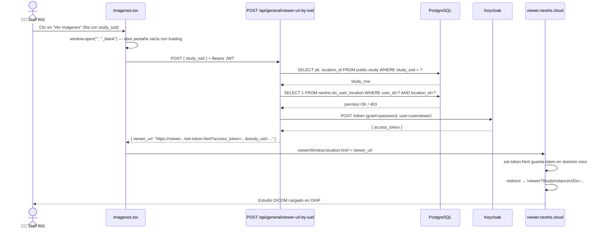
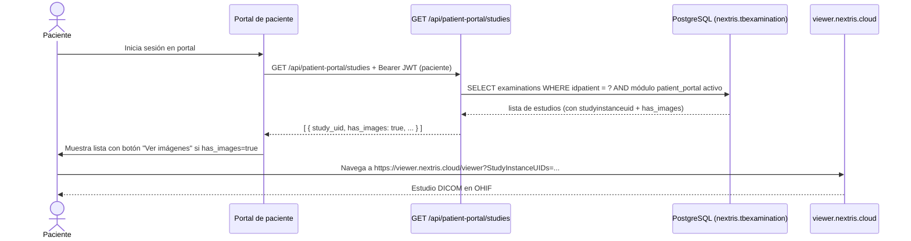
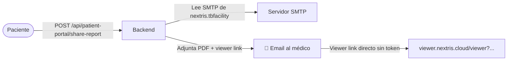
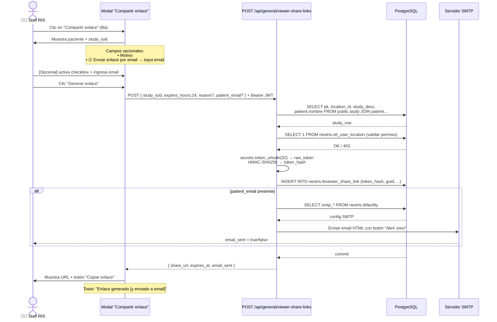
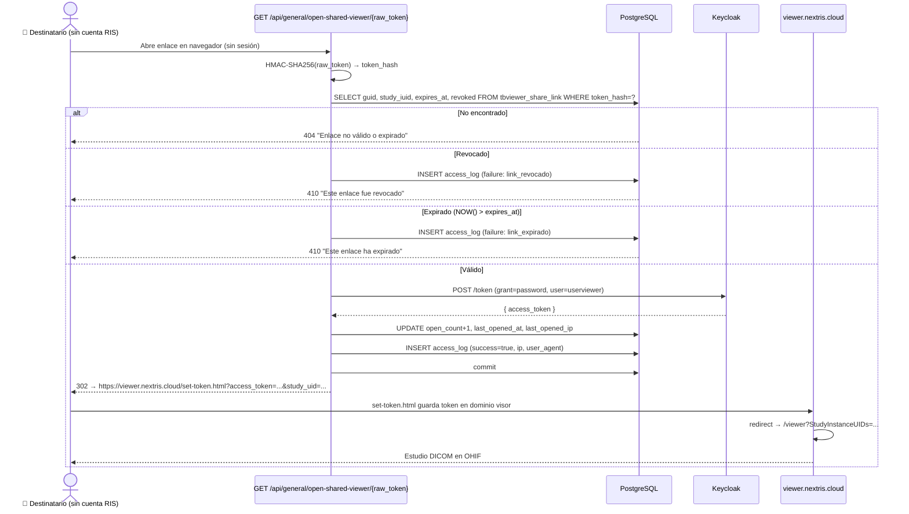
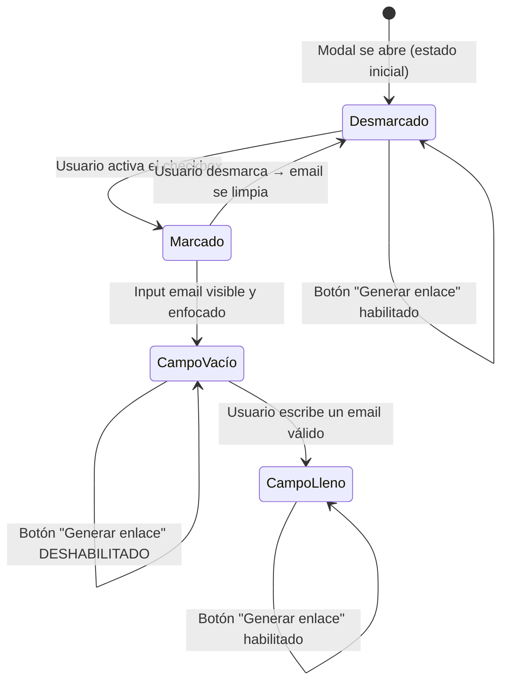

# Flujo técnico — Apertura y distribución del visor de imágenes en NextRIS

## 1. Objetivo funcional

NextRIS ofrece **tres variantes** para que alguien acceda al visor OHIF de un estudio DICOM.
Cada variante tiene un nivel de autenticación, un actor y un propósito diferente:

| Variante | Actor | Autenticación | Propósito |
|---|---|---|---|
| **A · Sistema (staff interno)** | Técnico / radiólogo logueado en RIS | JWT de la sesión RIS | Abrir el visor desde la pantalla *Redacción → Imágenes* |
| **B · Portal de paciente** | Paciente logueado en el portal | JWT del portal de pacientes | El paciente consulta sus propios estudios |
| **C · Enlace temporal** | Cualquier persona (sin cuenta en RIS) | Hash opaco de único uso + TTL | Compartir acceso externo a un estudio |

---

## 2. Arquitectura común a los tres flujos

```
┌────────────────────────────────────────────────────────────────────┐
│  NextRIS Frontend  (React — puerto 5173 / Nginx en producción)     │
└─────────────────────────────┬──────────────────────────────────────┘
                              │ HTTP/JWT (flujos A y B)
                              │ HTTP sin auth (flujo C)
┌─────────────────────────────▼──────────────────────────────────────┐
│  NextRIS Backend  (Flask — puerto 5001)                            │
│  apps/api/general.py                                               │
│  apps/api/patient_portal.py                                        │
└───────┬─────────────────────┬──────────────────────────────────────┘
        │ Consulta permisos   │ Pide token técnico
        │                     │
┌───────▼──────┐   ┌──────────▼──────────┐
│  PostgreSQL  │   │  Keycloak / DCM4CHE │
│  pacsdb      │   │  localhost:8090     │
│  nextris.*   │   │  realm: dcm4che     │
│  public.*    │   │  user: userviewer   │
└──────────────┘   └──────────┬──────────┘
                               │ access_token
                   ┌───────────▼──────────────────────────────────┐
                   │  viewer.nextris.cloud                        │
                   │  set-token.html → /viewer?StudyInstanceUIDs  │
                   └──────────────────────────────────────────────┘
```

> **Punto clave**: NextRIS nunca pasa su JWT de sesión al visor.
> En todos los flujos, la autenticación del visor se hace con un token técnico
> emitido por Keycloak usando la cuenta `userviewer`.

---

## 3. Flujo A — Sistema interno (staff del RIS)

### 3.1 Dónde ocurre

- Ruta: `/estudios/imagenes`
- Componente: `src/modules/redaccion/Imagenes/Imagenes.tsx`
- Acción: botón ojo (`Ver imágenes`) en cada fila de la tabla

### 3.2 Diagrama de secuencia



### 3.3 Validaciones del backend (en orden)

1. `study_iuid` presente en body.
2. Estudio existe en `public.study`.
3. Si tiene `location_id` → usuario autenticado tiene entrada en `nextris.rel_user_location`.
4. Keycloak responde `200` al pedir token de `userviewer`.

### 3.4 Respuesta exitosa

```json
{
  "success": true,
  "data": {
    "viewer_url": "https://viewer.nextris.cloud/set-token.html?access_token=eyJ...&study_uid=1.2.840...",
    "direct_url": "https://viewer.nextris.cloud/viewer?StudyInstanceUIDs=1.2.840...",
    "expires_in": 300
  }
}
```

### 3.5 Por qué se usa `window.open` antes de obtener la URL

Los navegadores modernos bloquean popups abiertos dentro de callbacks asíncronos.
Al abrir la ventana **de forma síncrona** (antes del `fetch`) y luego redirigirla
cuando llega la respuesta, se evita el bloqueo del popup blocker.

---

## 4. Flujo B — Portal de paciente

### 4.1 Dónde ocurre

- Ruta: `/patient-portal/` (app React del portal o legacy)
- Backend: `apps/api/patient_portal.py`
- El paciente consulta su lista de estudios y puede ver el visor si `has_images = true`

### 4.2 Diferencia clave con el flujo A

El portal de paciente **no hace mediación de token Keycloak**.
La URL del visor que se entrega al paciente es directa:

```
https://viewer.nextris.cloud/viewer?StudyInstanceUIDs={study_uid}
```

Esto significa que el visor OHIF debe estar configurado para acceso público
(o con su propia autenticación), ya que el backend RIS no inyecta token.

### 4.3 Flujo: ver imágenes desde el portal



### 4.4 Flujo: compartir por email desde el portal (función existente)

En el portal existe también la posibilidad de que el paciente comparta su informe
con un médico por email. En ese caso, si el estudio tiene imágenes, el backend
**incluye la URL directa del visor en el cuerpo del email**:

```python
viewer_link = f"https://viewer.nextris.cloud/viewer?StudyInstanceUIDs={study_uid}"
```



> **Nota de seguridad**: la URL del visor en el email del portal es pública (sin token).
> El acceso al DICOM desde esa URL depende de la configuración de autenticación de DCM4CHE/OHIF.

---

## 5. Flujo C — Enlace temporal compartido (share link)

Este flujo fue implementado en `apps/api/general.py` + `Imagenes.tsx` para
permitir que el **staff interno genere un enlace de uso temporal** que puede
ser abierto por cualquier persona, **sin necesidad de tener cuenta en NextRIS**.

### 5.1 Dónde ocurre

- Ruta: `/estudios/imagenes`
- Componente: `src/modules/redaccion/Imagenes/Imagenes.tsx`
- Acción: ícono de compartir (`Compartir enlace`) en cada fila de la tabla
- Columnas que lo implementan: `src/modules/redaccion/Imagenes/components/columns.tsx`

### 5.2 Modelo de seguridad del token

```
┌─────────────────────────────────────────────────────────────────┐
│  Token opaco (raw_token)                                        │
│  secrets.token_urlsafe(32)  →  44 caracteres URL-safe          │
│  Solo viaja en la URL — NUNCA se persiste en ninguna tabla      │
├─────────────────────────────────────────────────────────────────┤
│  Hash del token (token_hash)                                    │
│  HMAC-SHA256(SECRET_KEY, raw_token)                             │
│  Solo este valor se guarda en nextris.tbviewer_share_link       │
└─────────────────────────────────────────────────────────────────┘
```

Incluso si la base de datos fuese comprometida, los hashes almacenados
no permiten reconstruir los tokens reales.

### 5.3 Tablas de base de datos

```sql
-- Registro del enlace
nextris.tbviewer_share_link
  guid              UUID  PK
  token_hash        TEXT  (HMAC-SHA256 — nunca el token plano)
  study_iuid        TEXT
  location_id       UUID
  created_by_user_id TEXT
  created_at        TIMESTAMPTZ
  expires_at        TIMESTAMPTZ
  revoked           BOOLEAN  DEFAULT FALSE
  open_count        INTEGER  DEFAULT 0
  last_opened_at    TIMESTAMPTZ
  last_opened_ip    TEXT
  reason            TEXT  (motivo opcional)
  patient_email     TEXT  (destinatario si se envió por email)
  created_ip        TEXT

-- Auditoría de aperturas
nextris.tbviewer_share_link_access
  share_guid        UUID  FK → tbviewer_share_link.guid
  opened_at         TIMESTAMPTZ
  success           BOOLEAN
  failure_reason    TEXT  (link_expirado / link_revocado / keycloak_error_*)
  ip_address        TEXT
  user_agent        TEXT
  reason            TEXT
```

### 5.4 Generación del enlace (staff → modal)



### 5.5 Apertura del enlace (destinatario — sin cuenta RIS)



### 5.6 Diseño del email HTML (cuando se activa el checkbox)

El email usa el sistema SMTP configurado en `nextris.tbfacility` (con fallback a variables de entorno).
Si el envío falla, **no bloquea la generación del enlace** — solo se devuelve `email_sent: false`.

```
┌────────────────────────────────────────────┐
│ ██████ NextRIS ████████████████████████ │  ← gradiente #2D1B4E → #440f6d
│    Sistema de Información Radiológica     │
├────────────────────────────────────────────┤
│                                            │
│  Se ha generado un enlace temporal         │
│  seguro para visualizar este estudio.      │
│                                            │
│  ┌── Detalle del estudio ───────────────┐  │  ← fondo #faf5ff / borde #e9d5ff
│  │ Paciente   APELLIDO^NOMBRE           │  │
│  │ Estudio    RX TORAX AP/LAT           │  │
│  │ Válido     25/03/2026 18:00 UTC      │  │
│  │ Motivo     Entrega de resultados     │  │  ← solo si reason fue completado
│  └──────────────────────────────────────┘  │
│                                            │
│     [ 🔬  Abrir visor de imágenes ]        │  ← botón gradiente púrpura
│                                            │
│  ⚠ Uso personal. No comparta con terceros. │  ← caja #fffbeb
├────────────────────────────────────────────┤
│   Mensaje automático · NextRIS             │  ← footer gris
└────────────────────────────────────────────┘
```

El email es `multipart/alternative`: parte `text/plain` para clientes básicos
+ parte `text/html` con estilos inline para GMail, Outlook y webmail.

### 5.7 Comportamiento del checkbox de email en el modal



---

## 6. Comparativa de los tres flujos

| Característica | A · Sistema | B · Portal | C · Enlace temporal |
|---|---|---|---|
| **Actor que abre el visor** | Staff RIS | Paciente | Cualquier persona |
| **Requiere cuenta NextRIS** | Sí (JWT RIS) | Sí (JWT portal) | No |
| **Duración del acceso** | Sesión Keycloak (~5 min) | Indefinida (URL pública) | TTL configurable (1–168 h) |
| **Token Keycloak mediado** | Sí, por backend RIS | No (URL directa) | Sí, por backend RIS |
| **Hash seguro del token** | N/A | N/A | HMAC-SHA256 |
| **Auditoría de aperturas** | No | No | Sí (`tbviewer_share_link_access`) |
| **Contador de aperturas** | No | No | Sí (`open_count`) |
| **Revocable** | N/A | N/A | Sí (`revoked = true`) |
| **Envío por email** | No | Sí (PDF + link directo) | Sí (enlace mediado, HTML) |
| **Permiso validado** | `rel_user_location` | Propiedad del paciente | `rel_user_location` al crear |
| **Endpoint principal** | `POST /api/general/viewer-url-by-iuid` | `GET /api/patient-portal/studies` | `POST /api/general/viewer-share-links` + `GET /api/general/open-shared-viewer/{token}` |

---

## 7. Flujo completo end-to-end (los tres variantes lado a lado)

```mermaid
flowchart TD
    subgraph A["🏥 Flujo A — Staff interno"]
        A1([Staff logueado en RIS]) --> A2[Clic 'Ver imágenes'\nen /estudios/imagenes]
        A2 --> A3[POST /api/general/viewer-url-by-iuid\n+ JWT RIS]
        A3 --> A4{Permiso por\nrel_user_location}
        A4 -->|Denegado| A5[❌ 403]
        A4 -->|Aprobado| A6[Pide token a Keycloak\nuserviewer]
        A6 --> A7[Devuelve viewer_url\nset-token.html?access_token=...]
        A7 --> A8[Ventana nueva → OHIF]
    end

    subgraph B["👤 Flujo B — Portal de paciente"]
        B1([Paciente logueado\nen portal]) --> B2[Lista sus estudios\n/api/patient-portal/studies]
        B2 --> B3{has_images?}
        B3 -->|No| B4[Solo ve informe]
        B3 -->|Sí| B5[Link directo al viewer\n/viewer?StudyInstanceUIDs=...]
        B5 --> B6[OHIF — acceso público]
        B1 --> B7[Compartir informe\ncon médico por email]
        B7 --> B8[Email con PDF\n+ link directo al viewer]
    end

    subgraph C["🔗 Flujo C — Enlace temporal"]
        C1([Staff logueado en RIS]) --> C2[Clic 'Compartir enlace'\nen /estudios/imagenes]
        C2 --> C3[Modal: motivo + checkbox email]
        C3 --> C4[POST /api/general/viewer-share-links\n+ JWT RIS]
        C4 --> C5{Permiso por\nrel_user_location}
        C5 -->|Denegado| C6[❌ 403]
        C5 -->|Aprobado| C7[Genera raw_token\nGuarda HMAC hash en DB]
        C7 --> C8{¿Email activado?}
        C8 -->|Sí| C9[Lee SMTP de tbfacility\nEnvía email HTML estilizado]
        C8 -->|No| C10[Solo devuelve URL]
        C9 --> C10
        C10 --> C11([Destinatario recibe URL\nsin cuenta RIS])
        C11 --> C12[GET /api/general/open-shared-viewer/token]
        C12 --> C13{Verificaciones:\n¿existe? ¿revocado?\n¿expirado?}
        C13 -->|Falla| C14[❌ 404 / 410]
        C13 -->|OK| C15[Pide token a Keycloak\nuserviewer]
        C15 --> C16[Registra apertura\nen tbviewer_share_link_access]
        C16 --> C17[302 → set-token.html\n→ OHIF]
    end
```



---

## 8. Archivos clave del sistema

| Archivo | Responsabilidad |
|---|---|
| `apps/api/general.py` | Todos los endpoints del visor: `viewer-url-by-iuid`, `viewer-share-links`, `open-shared-viewer` |
| `apps/api/patient_portal.py` | Estudios del paciente con `has_images` + compartir informe con link directo |
| `src/modules/redaccion/Imagenes/Imagenes.tsx` | Pantalla principal de Imágenes: flujo A (ver) + flujo C (compartir enlace + modal) |
| `src/modules/redaccion/Imagenes/components/columns.tsx` | Acciones de la tabla: `getImageActions(onView, onShare)` |
| `deployment/migrations/create_viewer_share_links.sql` | Crea `nextris.tbviewer_share_link` + `nextris.tbviewer_share_link_access` + índices |

---

## 9. Consideraciones de seguridad

- **OWASP A01 — Broken Access Control**: el permiso se valida en el backend con JWT + `rel_user_location`. El frontend nunca toma decisiones de autorización.
- **OWASP A02 — Cryptographic Failures**: los tokens de enlace temporal nunca se persisten en texto plano. Solo se almacena el hash HMAC-SHA256.
- **Token Keycloak**: la cuenta técnica `userviewer` es de solo lectura en DCM4CHE y no tiene acceso a la gestión del RIS.
- **TTL del enlace**: máximo 168 horas (7 días). El sistema valida expiración en cada apertura, no solo al crear.
- **Auditoría**: cada apertura (exitosa o fallida) queda registrada en `tbviewer_share_link_access` con IP, user-agent y timestamp.
- **Revocación**: campo `revoked` en `tbviewer_share_link` permite deshabilitar el enlace sin borrarlo (conserva historial de auditoría).


## 7. Comportamientos de error en frontend

`Imagenes.tsx` contempla estos casos:

1. Sin `study_iuid`: toast inmediato.
2. Popup bloqueado por navegador: toast para habilitar popups.
3. Backend sin `viewer_url` o `success=false`: cierra ventana y muestra error.
4. Error de red/timeout: cierra ventana y muestra error.

Esto evita dejar ventanas vacias "colgadas" en error.

## 8. Diferencia con otros flujos de visor en el proyecto

Existen otras rutas/servicios historicos:

- `POST /api/general/viewer-url` (por `examination_id`).
- `src/services/dicomViewer.ts` (cliente axios para endpoint legacy).

Pero en Redaccion > Imagenes, el flujo actual operativo usa `viewer-url-by-iuid` con `study_iuid` proveniente de `public.study`.

## 9. Consideraciones de seguridad y operacion

1. La autorizacion efectiva esta en backend, no en frontend.
2. El token del viewer es temporal (`expires_in`), pero viaja en query string hacia `set-token.html`.
3. Se recomienda no loguear URLs completas de viewer en proxies para no exponer tokens en logs.
4. Si falla integracion con Keycloak, la apertura del visor cae con `500` y frontend muestra error generico.

## 10. Puntos clave para depuracion

Si "no abre visor" en esta pantalla, revisar en este orden:

1. Frontend: existe `study_iuid` en la fila clickeada.
2. Navegador: popup no bloqueado.
3. Request `POST /api/general/viewer-url-by-iuid`:
   - status
   - body de error
4. Backend `general.py`:
   - estudio existe en `public.study`
   - `location_id` y relacion en `nextris.rel_user_location`
5. Conectividad Keycloak en `localhost:8090`.
6. Dominio `viewer.nextris.cloud` y `set-token.html` accesibles.

## 11. Resumen tecnico corto

Redaccion > Imagenes abre visor con un modelo de 2 pasos:

1. NextRIS backend autoriza por `study_iuid` + location del usuario y genera token temporal.
2. Viewer domain recibe token en `set-token.html`, lo instala en su storage y redirige a OHIF para cargar el estudio.

## 12. Posibilidades: compartir enlace por mail para abrir directamente la imagen

Respuesta corta: tecnicamente si es posible compartir un enlace, pero con el flujo actual no es recomendable como mecanismo formal de distribucion.

### 12.1 Que pasa si compartes el `viewer_url` actual

El `viewer_url` contiene `access_token` en query string hacia `set-token.html`.

Si se comparte por mail:

1. Cualquier receptor con ese enlace podria abrir el estudio mientras el token siga vigente.
2. El enlace podria quedar expuesto en historiales, logs o reenvios.
3. Al expirar el token, deja de funcionar.

### 12.2 Entonces, se puede o no se puede

- Si la pregunta es "funciona tecnicamente": si, durante la vigencia del token.
- Si la pregunta es "es buena practica para produccion": no, salvo controles adicionales.

### 12.3 Recomendacion para un esquema seguro de compartir por mail

Implementar un flujo de "share link" dedicado, diferente al `viewer_url` operativo:

1. Generar enlace firmado de un solo uso o uso limitado, con expiracion corta.
2. No incluir bearer token reutilizable en query params.
3. Exigir validacion adicional del receptor (login o codigo de acceso).
4. Registrar auditoria completa (quien compartio, destinatario, fecha, aperturas).
5. Permitir revocacion manual anticipada.

### 12.4 Estado actual del proyecto

Con el codigo actual de Redaccion > Imagenes, no existe un endpoint especifico de "compartir por mail" con controles de reparto; solo existe el flujo de apertura interactiva al hacer clic en el boton.
