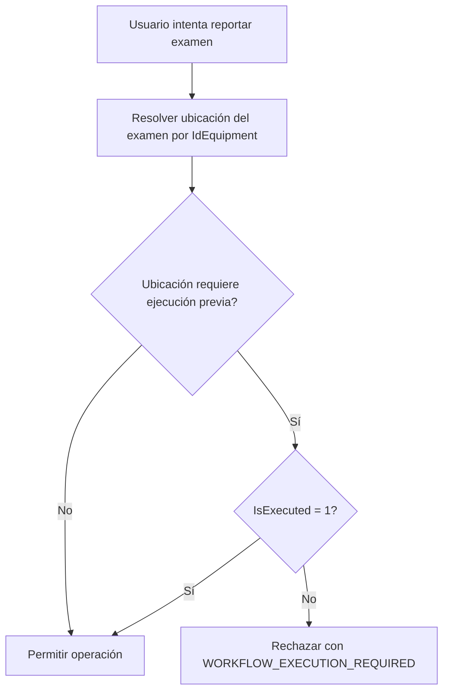
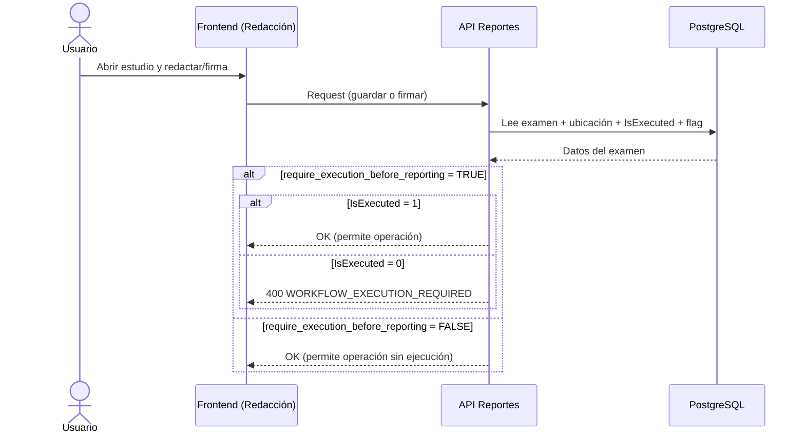

# Flujo de trabajo por ubicación: ejecución previa para reportes

## 1. Objetivo

Este documento describe el comportamiento funcional y técnico del nuevo flag por ubicación:

- Campo: require_execution_before_reporting
- Alcance: redacción, firmado y navegación de siguiente examen
- Default: TRUE (mantiene comportamiento histórico)

Cuando el flag está activo en una ubicación, el examen debe tener IsExecuted = 1 para poder reportarse.
Cuando el flag está inactivo, se permite redactar y firmar sin ejecución previa.

---

## 2. Dónde se configura

El usuario administrador lo gestiona en el modal de Editar Location, pestaña Información general.

Campo UI:

- Label: Requerir ejecución previa para reportar
- Tipo: checkbox/switch booleano
- Semántica:
  - ON: exige IsExecuted = 1
  - OFF: permite redactar/firmar aunque IsExecuted = 0

---

## 3. Modelo de datos

Migración aplicada:

- Tabla: nextris.tblocation
- Columna: require_execution_before_reporting BOOLEAN NOT NULL DEFAULT TRUE

SQL:

```sql
ALTER TABLE nextris.tblocation
    ADD COLUMN IF NOT EXISTS require_execution_before_reporting BOOLEAN NOT NULL DEFAULT TRUE;
```

Razonamiento del default TRUE:

- Evita regresiones en producción.
- Mantiene el mismo comportamiento en ubicaciones existentes hasta que se decida apagar el switch explícitamente.

---

## 4. Flujo de decisión de negocio



Regla implementada:

- Permitir si: require_execution_before_reporting = FALSE
- Permitir si: IsExecuted = 1
- Bloquear solo cuando:
  - require_execution_before_reporting = TRUE y
  - IsExecuted = 0

---

## 5. Impacto en endpoints

### 5.1 Configuración de ubicaciones

Endpoints que exponen y persisten el flag:

- GET /api/config/locations
- POST /api/config/locations
- PUT /api/config/locations/<location_id>
- GET /api/locations
- GET /api/locations/<guid>
- POST /api/locations
- PUT /api/locations/<guid>

Ejemplo payload update:

```json
{
  "require_execution_before_reporting": false
}
```

---

### 5.2 Reportería

Se aplicó en:

- GET /api/examinations/for-reporting
- POST /api/reports/next-exam
- POST /api/reports/<exam_id>/sign
- PUT/PATCH /api/examinations/<exam_id>/report

Error de negocio cuando corresponde bloqueo:

```json
{
  "success": false,
  "message": "La ubicación requiere ejecución previa del examen antes de redactar o firmar el reporte.",
  "code": "WORKFLOW_EXECUTION_REQUIRED"
}
```

---

## 6. Qué pasó con las queries

## 6.1 Listado para redacción

Antes:

```sql
... WHERE eq.location_id IN (...)
AND e.IsExecuted = 1
```

Ahora:

```sql
... WHERE eq.location_id IN (...)
AND (
  COALESCE(loc.require_execution_before_reporting, TRUE) = FALSE
  OR e.IsExecuted = 1
)
```

Efecto:

- Si la ubicación no requiere ejecución previa, el examen aparece aunque no esté ejecutado.

---

## 6.2 Siguiente examen (auto-next)

Antes:

```sql
... WHERE eq.location_id IN (...)
AND e.IsExecuted = 1
AND e.Guid != %s
```

Ahora:

```sql
... WHERE eq.location_id IN (...)
AND (
  COALESCE(loc.require_execution_before_reporting, TRUE) = FALSE
  OR e.IsExecuted = 1
)
AND e.Guid != %s
```

Efecto:

- El siguiente examen respeta la misma regla por ubicación y no omite estudios válidos cuando el switch está OFF.

---

## 6.3 Guardar reporte

Validación previa al upsert de tbreport:

```sql
SELECT e.IdPatient,
       e.AdmisionNumber,
       COALESCE(e.IsExecuted, 0) AS is_executed,
       COALESCE(loc.require_execution_before_reporting, TRUE) AS require_execution_before_reporting
FROM nextris.tbexamination e
LEFT JOIN nextris.isequipment eq ON e.IdEquipment = eq.Guid
LEFT JOIN nextris.tblocation loc ON eq.location_id = loc.guid
WHERE e.Guid = %s
```

Lógica:

- Si can_edit_or_sign_report es false, responde 400 con WORKFLOW_EXECUTION_REQUIRED.

---

## 6.4 Firmar reporte

Validación equivalente previa a generar PDF y marcar IsReported:

```sql
SELECT e.LocalAcc,
       p.PatientId,
       p.Name,
       p.Surname,
       e.IdPatient,
       COALESCE(e.IsExecuted, 0) AS is_executed,
       COALESCE(loc.require_execution_before_reporting, TRUE) AS require_execution_before_reporting
FROM nextris.tbexamination e
LEFT JOIN nextris.datapatient p ON e.IdPatient = p.Guid
LEFT JOIN nextris.isequipment eq ON e.IdEquipment = eq.Guid
LEFT JOIN nextris.tblocation loc ON eq.location_id = loc.guid
WHERE e.Guid = %s
```

---

## 7. Secuencia completa por escenario



---

## 8. Matriz de comportamiento

| Flag ubicación | IsExecuted | Listado reportes | Guardar reporte | Firmar reporte | Siguiente examen |
|---|---:|---|---|---|---|
| TRUE | 0 | No aparece | Bloqueado (400) | Bloqueado (400) | No elegible |
| TRUE | 1 | Aparece | Permitido | Permitido | Elegible |
| FALSE | 0 | Aparece | Permitido | Permitido | Elegible |
| FALSE | 1 | Aparece | Permitido | Permitido | Elegible |

---

## 9. Compatibilidad y fallback

Se usó COALESCE(..., TRUE) en queries y validaciones.

Esto garantiza que si una ubicación vieja no tiene dato explícito en la columna, el sistema se comporta como antes (requiere ejecución).

---

## 10. Checklist de validación manual

1. En Configuración > Ubicaciones, editar una location y activar el checkbox.
2. Probar examen no ejecutado de esa location:
   - No debe aparecer en for-reporting.
   - Guardar/Firmar debe fallar con WORKFLOW_EXECUTION_REQUIRED.
3. Desactivar el checkbox en esa misma location.
4. Repetir con examen no ejecutado:
   - Debe aparecer en for-reporting.
   - Guardar/Firmar debe funcionar.
5. Verificar auto-next:
   - Debe incluir exámenes no ejecutados cuando el flag está OFF.

---

## 11. Recomendaciones operativas

- Mantener ON en sedes que exijan protocolo estricto PACS-before-report.
- Usar OFF solo en sedes/servicios donde el flujo clínico requiera pre-redacción o dictado adelantado.
- Auditar periódicamente ubicaciones con OFF para control de calidad clínica.
